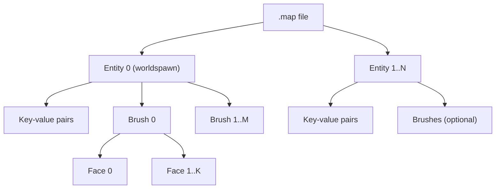

# Feature 1 — Map Parsing (Standard & Valve 220)

[← Back to main spec](../spec.md)

---

## Overview

Parse a plain-text Quake `.map` file in the **Standard Quake format** or the **Valve 220 variation** (as supported by TrenchBroom and ericw-tools) into structured `ParsedEntity[]` data. The parser auto-detects the format by inspecting face line syntax.

**Input:** `.map` file contents (string)
**Output:** `ParsedEntity[]`

**Primary code file:** `src/pipeline/01-map-parsing.ts`

---

## Format Identification

The file header comment identifies the format:

```
// Game: Quake
// Format: Valve
```

The presence of `"mapversion" "220"` in the `worldspawn` entity properties also confirms Valve 220 format.

---

## File Structure

A `.map` file is a sequence of entities. Each entity is delimited by `{ }` and contains key-value pairs and zero or more brushes. Brushes are themselves delimited by nested `{ }`.



The compiler processes **only brush geometry**. Entity key-value metadata (classname, origin, spawnflags, etc.) is parsed and stored in the output but does not affect geometry compilation. The `worldspawn` entity (entity 0) contains the static world brushes — these are the only brushes that participate in inter-brush CSG (Feature 3). Other entities may contain brushes (func_wall, func_door, etc.) which are passed through to triangulation without CSG, preserving their full geometry.

---

## Brush Face Definition (Valve 220)

Each face line in a Valve 220 brush has the following format:

```
( x1 y1 z1 ) ( x2 y2 z2 ) ( x3 y3 z3 ) TEXTURE [ Ux Uy Uz Uoffset ] [ Vx Vy Vz Voffset ] rotation Uscale Vscale
```

| Field | Type | Description |
|-------|------|-------------|
| (x1 y1 z1) (x2 y2 z2) (x3 y3 z3) | 3 × Vec3 | Three points defining the face plane. Must be non-collinear. |
| TEXTURE | string | Texture name (e.g. `mmetal1_2`, `__TB_empty`). |
| [ Ux Uy Uz Uoffset ] | Vec3 + number | U texture axis direction (world space) and pixel offset. |
| [ Vx Vy Vz Voffset ] | Vec3 + number | V texture axis direction (world space) and pixel offset. |
| rotation | number | Ignored. In Valve 220 format, rotation is already baked into the U/V axis vectors. Retained for format compatibility only. |
| Uscale | number | Scale divisor for the U axis. A value of 1 means 1 texture pixel = 1 world unit along the U axis. |
| Vscale | number | Scale divisor for the V axis. |

### Plane Derivation from Three Points

The three points P1, P2, P3 define the face plane. The plane normal is computed as:

```
normal = normalize( cross(P3 − P1, P2 − P1) )
distance = dot(normal, P1)
```

The normal points **outward** from the brush solid (into the void). Every point **p** where dot(p, normal) − distance ≤ 0 is inside the half-space defined by this face.

### Texture Coordinate Computation (Valve 220)

Unlike the standard Quake format (which derives texture axes from the plane normal and applies rotation/offset), the Valve 220 format stores **explicit world-space texture axis vectors** per face. This allows arbitrary texture alignment independent of face orientation.

For a vertex at world position **p**, texture coordinates are computed as:

```
u = ( dot(p, Uaxis) + Uoffset ) / Uscale
v = ( dot(p, Vaxis) + Voffset ) / Vscale
```

where `Uaxis = (Ux, Uy, Uz)` and `Vaxis = (Vx, Vy, Vz)` are taken directly from the face definition. The result is in **texel space**. To obtain normalized [0, 1] UV coordinates for rendering, divide by the texture dimensions:

```
uv.u = u / textureWidth
uv.v = v / textureHeight
```

Texture dimensions must be known at compile time (loaded from a material/texture database or WAD file).

---

## Standard Quake Format

When the face line does **not** contain `[ ]` bracket groups, the parser falls back to the Standard Quake format:

```
( x1 y1 z1 ) ( x2 y2 z2 ) ( x3 y3 z3 ) TEXTURE offsetX offsetY rotation scaleX scaleY
```

| Field | Type | Description |
|-------|------|-------------|
| (x1 y1 z1) (x2 y2 z2) (x3 y3 z3) | 3 × Vec3 | Three points defining the face plane. |
| TEXTURE | string | Texture name. |
| offsetX, offsetY | number | Texture pixel offsets. |
| rotation | number | Texture rotation in degrees (not used — axes are derived from normal). |
| scaleX, scaleY | number | Scale divisors for the U and V axes. |

Since the Standard format does not encode explicit texture axis vectors, the parser **derives texture axes from the face plane normal**:

- If |n.z| is maximal: U axis = (1, 0, 0), V axis = (0, −1, 0)
- If |n.x| is maximal: U axis = (0, 1, 0), V axis = (0, 0, −1)
- If |n.y| is maximal: U axis = (1, 0, 0), V axis = (0, 0, −1)

The offsets and scales from the face line are stored in `texOffsetU`, `texOffsetV`, `texScaleU`, `texScaleV` as usual.

> **Implementation note:** The parser auto-detects format per face line by checking whether the token after the texture name is `[` (Valve 220) or a bare number (Standard). Both formats can coexist in the same file, though this is unusual in practice.

---

## Parsing Rules

1. Lines beginning with `//` are comments and are skipped.
2. All numeric values are parsed as IEEE 754 doubles (standard JavaScript/TypeScript `number` type). The Valve 220 format permits non-integer plane coordinates.
3. A brush must have ≥ 4 face definitions to form a valid convex solid. Brushes with fewer faces are rejected with a diagnostic warning.
4. Texture names are case-insensitive; the parser lowercases them at parse time so all downstream processing uses consistently lowercased names. They are resolved against a material table provided separately to the compiler.
5. Entities are indexed in parse order. Entity 0 must have `"classname" "worldspawn"`.

---

## Output Data Structures

```typescript
interface ParsedFace {
    planePoints: [Vec3, Vec3, Vec3]; // P1, P2, P3
    normal: Vec3;                    // derived: normalize(cross(P3−P1, P2−P1))
    distance: number;                // derived: dot(normal, P1)
    textureName: string;
    texAxisU: Vec3;                  // (Ux, Uy, Uz)
    texOffsetU: number;
    texAxisV: Vec3;                  // (Vx, Vy, Vz)
    texOffsetV: number;
    texScaleU: number;
    texScaleV: number;
}

interface ParsedBrush {
    faces: ParsedFace[];             // length ≥ 4
}

interface ParsedEntity {
    properties: Record<string, string>; // e.g. classname, origin, spawnflags
    brushes: ParsedBrush[];
}
```

---

## Verification

### Unit Tests

1. **Minimal valid brush:** Parse a single entity containing one 6-sided axis-aligned box brush. Assert output has 1 entity, 1 brush, 6 faces, and that each face normal is axis-aligned with length 1.
2. **Entity key-value pairs:** Parse a `.map` snippet with `"classname" "worldspawn"`, `"message" "Hello"`. Assert `properties` map contains both pairs with correct values.
3. **Plane derivation:** For a known face line, compute the expected normal and distance by hand. Assert `ParsedFace.normal` and `ParsedFace.distance` match within ε = 1e-5.
4. **Texture axis preservation:** Parse a face with non-trivial Valve 220 axes (e.g. rotated 45°). Assert `texAxisU`, `texAxisV`, offsets, and scales are stored exactly as written in the source.
5. **Multi-entity ordering:** Parse a file with 3 entities. Assert entity 0 is `worldspawn` and entities are returned in file order.
6. **Degenerate brush rejection:** Parse a brush with only 3 faces. Assert it is rejected (not present in output) and a diagnostic warning is emitted.
7. **Comment handling:** Insert `// comment` lines between face definitions. Assert they are ignored and the brush parses correctly.
8. **Non-integer coordinates:** Parse a face line with floating-point plane points (e.g. `( 0.5 1.25 -3.75 )`). Assert values are parsed as doubles without truncation.

### Integration Smoke Test

Parse `tests/fixtures/box.map` (1 worldspawn entity, 1 brush, 6 faces). Round-trip: re-derive each face plane from `planePoints` and assert the result matches `normal`/`distance`.

---

## Implementation

### Exported Function

```typescript
// pipeline/01-map-parsing.ts
export function parseMap(source: string, diagnostics?: Diagnostics): ParsedEntity[]
```

### Algorithm

1. **Tokeniser.** Split the input into tokens: `{`, `}`, quoted strings (`"…"`), and unquoted words. Track line numbers for diagnostic messages. Comments (`//` to end-of-line) are stripped during tokenisation.
2. **Entity loop.** Consume `{`, then alternate between:
   - **Key-value pair:** two consecutive quoted-string tokens → store in `properties`.
   - **Brush:** `{` token → enter brush parser.
   - **`}`** → emit the completed `ParsedEntity`.
3. **Brush parser.** Consume face lines until `}`. Each face line is parsed by:
   - Reading three `( x y z )` groups → `planePoints`.
   - Reading the texture name token → `textureName` (lowercased).
   - Reading `[ Ux Uy Uz Uoffset ]` → `texAxisU`, `texOffsetU`.
   - Reading `[ Vx Vy Vz Voffset ]` → `texAxisV`, `texOffsetV`.
   - Reading `rotation` (discarded), `Uscale`, `Vscale`.
   - Deriving `normal` and `distance` from `planePoints`.
4. **Validation.** After parsing a brush, reject it if `faces.length < 4` and emit a diagnostic warning.
5. **Entity 0 assertion.** After parsing all entities, verify `entities[0].properties.classname === 'worldspawn'`. If not, emit a diagnostic error.

### Edge Cases

- **Empty entities** (no brushes, only key-value pairs) are valid — they represent point entities.
- **Escaped quotes** in property values (`\"`) are not used by TrenchBroom's Valve 220 exporter; the parser does not need to handle them.
- **Scale values of 0** should be clamped to 1 with a diagnostic warning to avoid division by zero downstream.
