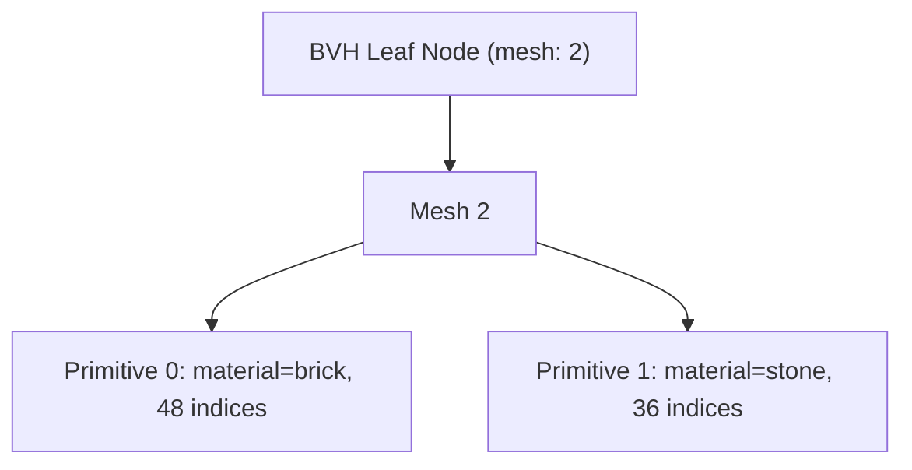

# Feature 8 — glTF/GLB Export

[← Back to main spec](../spec.md)

---

## Overview

Serialize all compiled data into a single **GLB** (glTF Binary) file. The worldspawn BVH is encoded as a glTF node hierarchy, worldspawn clusters map to world mesh primitives, and non-worldspawn entities are exported as independently identifiable meshes and nodes.

**Input:** Material batches, worldspawn clusters, worldspawn BVH nodes, non-worldspawn entity clusters, parsed entity metadata, and optional `TextureMap` (from [Feature 12](12-texture-resolution.md))
**Output:** `.glb` file (glTF 2.0 Binary)

**Primary code file:** `src/pipeline/08-binary-export.ts`

---

## Why glTF

| Concern | glTF answer |
|---------|-------------|
| BVH storage | Node hierarchy with `children` arrays maps 1-to-1 to BVH tree structure |
| AABB metadata | `node.extras.aabb` stores `{ min: [x,y,z], max: [x,y,z] }` per node |
| Cluster geometry | Each cluster becomes a mesh primitive with its own material and index range |
| GPU-ready buffers | GLB binary chunk stores tightly packed vertex/index data (little-endian) |
| Debugging | Standard tools (Blender, VS Code glTF viewer, three.js) can inspect output |
| TypeScript ecosystem | Libraries like `@gltf-transform/core` simplify GLB construction |

**Trade-off:** The runtime reconstructs a flat BVH array from the node tree at load time. This is a one-time cost, not per-frame, and is minor compared to the interop and debugging benefits.

---

## Coordinate System

Quake uses **Z-up, right-handed**. glTF uses **Y-up, right-handed**. The exporter applies a coordinate conversion: rotate **-90° around X** on all vertex positions and normals before writing. This ensures the output renders correctly in any standard glTF viewer.

---

## Worldspawn BVH → Node Hierarchy

Each `BVHNode` from Feature 7 becomes a glTF node. The tree structure is encoded via the `children` property.

### Interior Node

```json
{
    "name": "bvh_0",
    "children": [1, 2],
    "extras": {
        "nodeType": "interior",
        "aabb": { "min": [-128, 0, -128], "max": [128, 64, 128] }
    }
}
```

No `mesh` reference. The `children` array contains the indices of the left and right child nodes.

### Leaf Node

```json
{
    "name": "bvh_leaf_5",
    "mesh": 2,
    "extras": {
        "nodeType": "leaf",
        "aabb": { "min": [0, 0, 0], "max": [16, 8, 16] }
    }
}
```

The `mesh` property references a glTF mesh whose primitives contain the leaf's **worldspawn** cluster geometry.

---

## Worldspawn Clusters → Meshes & Primitives

Each worldspawn BVH leaf node references **one glTF mesh**. That mesh contains **one primitive per worldspawn cluster** in the leaf's cluster range. Each primitive has its own material and index range.



### Primitive Structure

Each primitive specifies:

| Property | Accessor type | Description |
|----------|---------------|-------------|
| `POSITION` | `VEC3` / `FLOAT` | Vertex positions (Y-up, after coordinate conversion) |
| `NORMAL` | `VEC3` / `FLOAT` | Face normals (flat shading) |
| `TEXCOORD_0` | `VEC2` / `FLOAT` | Valve 220 texture coordinates |
| `indices` | `SCALAR` / `UNSIGNED_INT` | Triangle index buffer |

`POSITION` accessors **must** define `min` and `max` per the glTF spec. These values double as the primitive-level AABB.

---

## Materials

Each unique texture name from the `.map` file becomes a glTF material. Material generation depends on whether the texture was resolved by the `TextureProvider` ([Feature 12](12-texture-resolution.md)).

### Resolved Texture

When a texture was successfully resolved, the material references the texture as an **external image** via `baseColorTexture`:

```json
{
    "name": "brick_wall",
    "pbrMetallicRoughness": {
        "baseColorTexture": {
            "index": 0
        },
        "metallicFactor": 0,
        "roughnessFactor": 1
    }
}
```

With corresponding glTF **image** and **texture** entries:

```json
{
    "images": [
        { "name": "brick_wall.png", "mimeType": "image/png" }
    ],
    "textures": [
        { "source": 0 }
    ]
}
```

Textures are **not embedded** in the GLB binary chunk — they remain external files referenced by name. This keeps the GLB small and allows texture sharing across multiple GLBs. Standard loaders (three.js `GLTFLoader`, Blender) resolve external URIs relative to the GLB file location.

> **Implementation note — GLB image storage:** When `@gltf-transform/core` serializes a texture with `setURI(relativePath)` into GLB format, the URI is stored as the image's `name` property in the JSON chunk (not `uri`), because GLB images typically use embedded buffer views. The texture reference remains valid for consumers that read the image metadata.

### Unresolved Texture (Placeholder)

When a texture could not be resolved (or no `TextureMap` is provided), a **magenta placeholder** material is created:

```json
{
    "name": "missing_texture_name",
    "pbrMetallicRoughness": {
        "baseColorFactor": [1, 0, 1, 1],
        "metallicFactor": 0,
        "roughnessFactor": 1
    }
}
```

This is visually distinct and signals that the texture is missing.

### Texture Deduplication

Multiple materials may reference the same texture file. glTF images and textures are deduplicated: if two materials use the same `relativePath`, they share the same image/texture index. The deduplication uses an internal `imageMap: Map<string, Texture>` keyed by `relativePath`.

### Texture Lookup

The texture name is looked up in the `TextureMap` using both the original case and lowercase:

```typescript
const texInfo = textureMap?.get(texName.toLowerCase()) ?? textureMap?.get(texName) ?? null;
```

---

## Buffer Layout

All binary data is packed into a **single GLB buffer** (the BIN chunk). Buffer views are created for each data type:

| BufferView | Target | Contents |
|------------|--------|----------|
| 0 | `ARRAY_BUFFER` (34962) | All vertex positions (tightly packed `VEC3` floats) |
| 1 | `ARRAY_BUFFER` (34962) | All vertex normals (tightly packed `VEC3` floats) |
| 2 | `ARRAY_BUFFER` (34962) | All texture coordinates (tightly packed `VEC2` floats) |
| 3 | `ELEMENT_ARRAY_BUFFER` (34963) | All triangle indices (`UNSIGNED_INT`) |

Vertex attributes are stored in **separate buffer views** (non-interleaved / struct-of-arrays layout). This matches the pipeline output from Features 5–6 and allows the renderer to bind each attribute buffer independently.

All data is **little-endian** and **4-byte aligned** per the glTF spec. The GLB binary chunk is padded with trailing zeros to 4-byte alignment.

---

## Entity Export Branch

Non-worldspawn entities are exported outside the worldspawn BVH as first-class scene objects.

- The scene contains an `entities` grouping node when any entity geometry exists.
- Each non-worldspawn entity with visible geometry gets exactly one node and exactly one mesh.
- Each entity mesh contains one primitive per material used by that entity.
- Entity node and mesh metadata preserve at least `entityIndex`, and include `classname` / `targetname` when available.

---

## GLB File Structure

The output is a single `.glb` file following the glTF 2.0 Binary container spec:

```
┌──────────────────────────────┐
│ GLB Header (12 bytes)        │
│   magic: 0x46546C67 "glTF"  │
│   version: 2                 │
│   length: total file size    │
├──────────────────────────────┤
│ JSON Chunk                   │
│   scene, nodes, meshes,      │
│   materials, accessors,      │
│   bufferViews, buffer        │
├──────────────────────────────┤
│ BIN Chunk                    │
│   positions | normals |      │
│   texcoords | indices        │
└──────────────────────────────┘
```

---

## Scene Root

The glTF scene contains the worldspawn BVH root node and, when needed, a separate `entities` grouping node.

```json
{
    "scene": 0,
    "scenes": [{ "name": "map", "nodes": [0, 1] }],
    "asset": {
        "version": "2.0",
        "generator": "map2gltf"
    }
}
```

> **Implementation note — generator field:** The code sets `generator = 'map2gltf'` on the document asset, but `@gltf-transform/core` overrides this with its own generator string (e.g. `"glTF-Transform v4.x.x"`) during `writeBinary()`. The output GLB will contain the library's generator string, not `"map2gltf"`.

> **Implementation note — default scene:** `@gltf-transform/core` does not persist the default scene index in the output. `getDefaultScene()` returns `null` when reading back the GLB, even though a scene exists. Consumers should use `getRoot().listScenes()[0]` instead.

---

## Runtime Loading

At load time, the renderer:

1. Parses the GLB and extracts the JSON chunk.
2. Uploads buffer views 0–3 directly to GPU vertex/index buffers (zero-copy where supported).
3. Walks the node tree, reading `extras.aabb` from each node to rebuild a flat depth-first `BVHNode[]` array for frustum culling.
4. Locates entity nodes/meshes deterministically via `entityIndex` metadata and/or stable `entity_<index>` naming.
5. Maps each mesh primitive's accessor offsets to draw call parameters (`firstIndex`, `indexCount`, `material`).

The node tree → flat array conversion is O(N) where N is the number of BVH nodes.

---

## Verification

### Unit Tests

1. **Valid GLB header:** Write a minimal GLB. Assert the first 12 bytes contain magic `0x46546C67`, version `2`, and correct total file length.
2. **JSON chunk validity:** Parse the JSON chunk from the output GLB. Assert it is valid JSON and contains required top-level properties: `asset`, `scene`, `scenes`, `nodes`, `meshes`, `accessors`, `bufferViews`, `buffers`.
3. **Asset metadata:** Assert `asset.version` is `"2.0"`. Do not require a specific `asset.generator` string because `@gltf-transform/core` may override it during serialization.
4. **Coordinate conversion:** Export a vertex at Quake position (X, Y, Z). Read back from the GLB buffer and assert it matches the Y-up conversion: (X, Z, −Y).
5. **Node hierarchy matches BVH:** Rebuild the BVH tree from the glTF node hierarchy (`children` arrays). Assert it is isomorphic to the input `BVHNode[]` tree — same structure, same AABB values in `extras.aabb`.
6. **AABB extras round-trip:** For every node, read `extras.aabb.min` and `extras.aabb.max`. Assert they match the original `BVHNode.bounds` (after coordinate conversion) within ε.
7. **Primitive accessor ranges:** For every mesh primitive, assert: (a) `POSITION`, `NORMAL`, `TEXCOORD_0` accessors have matching element counts, (b) `indices` accessor count is a multiple of 3, and (c) all byte offsets + lengths fit within the BIN chunk size.
8. **POSITION min/max:** For every `POSITION` accessor, assert `min` and `max` are defined and correctly bound all vertex positions in that accessor.
9. **Material count:** Assert the number of glTF materials equals the number of unique texture names from the input.
10. **4-byte alignment:** Assert every `bufferView.byteOffset` is a multiple of 4, and the BIN chunk length is a multiple of 4.
11. **One mesh per entity:** For a scene containing two entities with visible geometry, assert the GLB contains two distinct entity meshes, one per `entityIndex`.
12. **One node per entity:** Assert each entity mesh is referenced by exactly one entity node.
13. **Entity metadata:** Assert entity nodes and/or meshes preserve `entityIndex`, `classname`, and `targetname` where available.
14. **World/entity separation:** Assert worldspawn BVH leaf meshes do not contain non-worldspawn entity geometry.

### Integration Smoke Test

Run the full pipeline (Features 1–8) on a mixed fixture containing worldspawn plus multiple entities with visible geometry. Load the output `.glb` in a third-party glTF validator (e.g. `gltf-validator` npm package). Assert zero errors, confirm the scene contains both the worldspawn BVH branch and the `entities` branch, and optionally load in three.js or Blender to verify visual correctness and entity isolation.

---

## Implementation

### Exported Function

```typescript
export async function exportGLB(
    batches: MaterialBatch[],
    worldClusters: Cluster[],
    bvh: BVHNode[],
    entityClusters?: Cluster[],
    entities?: ParsedEntity[],
    textureMap?: TextureMap,
): Promise<Uint8Array>
```

> **Implementation note — async:** `exportGLB` is `async` and returns `Promise<Uint8Array>` because `@gltf-transform/core`'s `NodeIO.writeBinary()` returns a Promise. This propagates up to `compile()` and `compileWithDiagnostics()`, making them async as well.

> **Implementation note — textureMap parameter:** The `textureMap` parameter is optional. When omitted (or `undefined`), all materials fall back to the magenta placeholder `[1, 0, 1, 1]`. This preserves backward compatibility for callers that don't use texture resolution.

> **Implementation note — AABB conversion:** When converting AABBs from Z-up to Y-up, the implementation converts all 8 corner points of the AABB and recomputes min/max, rather than simply swapping axes. This correctly handles the axis flip where min/max may swap.

### Algorithm

`exportGLB()` performs six high-level steps:

1. Create or reuse glTF materials for each material batch, attaching either a resolved texture or the magenta placeholder.
2. Build the worldspawn BVH node hierarchy as glTF nodes.
3. Attach meshes and primitives to BVH leaves.
4. Wire BVH parent-child relationships.
5. Export non-worldspawn entities as separate scene objects with identifying metadata.
6. Serialize the assembled document to GLB with `NodeIO.writeBinary()`.

Implementation reference: [src/pipeline/08-binary-export.ts](../../src/pipeline/08-binary-export.ts).

### Coordinate Conversion (Z-up → Y-up)

Rotate −90° around X on all positions and normals, using the mapping `(x, y, z) → (x, z, -y)`. For AABBs, convert the corners and recompute min/max in the target basis rather than swapping axes in place.

Implementation reference: [src/pipeline/08-binary-export.ts](../../src/pipeline/08-binary-export.ts).

### Primitive Construction

For each cluster, create typed arrays for positions, normals, UVs (as `Float32Array`), and indices (as `Uint32Array`) from the cluster's compacted vertex/index buffers. Apply coordinate conversion to positions and normals before writing. Use `@gltf-transform/core` accessor API to attach data to the document buffer.

### Buffer View Layout

The library handles buffer view creation internally. The specification requires 4 conceptual buffer views (positions, normals, UVs, indices), but `@gltf-transform/core` manages byte offsets and alignment automatically. All data ends up in a single BIN chunk.
