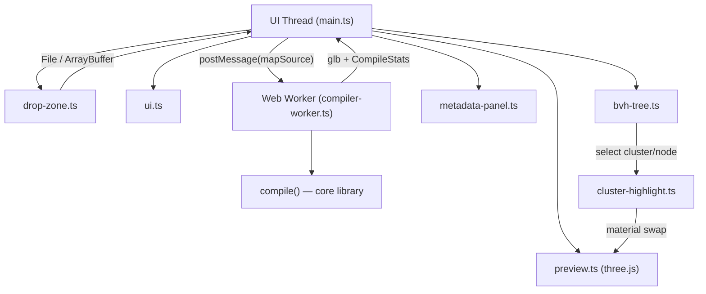
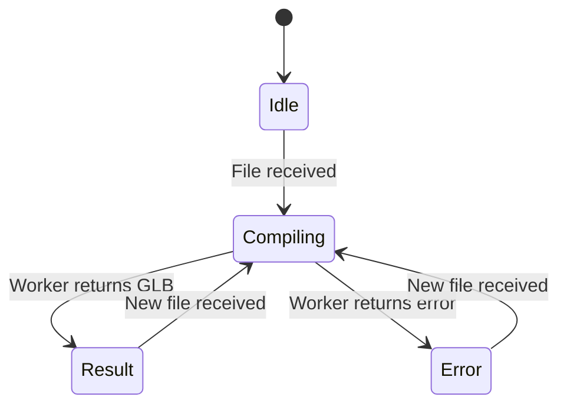

# Feature 11 — Web Application

[← Back to main spec](../spec.md)

---

## Overview

A single-page web application that allows users to convert Quake `.map` files to `.glb` entirely in the browser. Users load files via **drag-and-drop** or a **file input picker**, the compiler runs in a **Web Worker** to keep the UI responsive, and the resulting GLB is available for **download**, **3D preview**, and **visual inspection** (compilation stats, BVH tree viewer, cluster highlighting).

**Input:** npm package library (`compile()` from [Feature 9](09-npm-package.md))
**Output:** Static single-page application (HTML + JS + CSS), deployable to any static host

**Primary code file:** `web/src/main.ts`

---

## Architecture



The UI thread handles all DOM interaction. The compiler runs in a dedicated Web Worker so that large maps do not freeze the page.

### Source Files

| File | Responsibility |
|------|----------------|
| `web/src/main.ts` | Wire all components together |
| `web/src/drop-zone.ts` | Drag-and-drop + file input handler |
| `web/src/compiler-worker.ts` | Web Worker wrapping `compileDetailed()`, returns GLB + `CompileStats` |
| `web/src/ui.ts` | State machine (Idle → Compiling → Result/Error), panel toggle logic |
| `web/src/preview.ts` | three.js GLB preview (WebGLRenderer, PerspectiveCamera, OrbitControls) |
| `web/src/metadata-panel.ts` | Render compilation statistics in a summary panel |
| `web/src/bvh-tree.ts` | Build and render a collapsible tree from the glTF node hierarchy |
| `web/src/cluster-highlight.ts` | Manage highlight state: swap cluster materials to a distinct color on selection |

---

## File Loading

### Drag and Drop

A drop zone element covers the main content area. It accepts `.map` files dragged from the user's file system.

```typescript
// drop-zone.ts
export interface DropZoneOptions {
    element: HTMLElement;
    onFile: (file: File) => void;
    onError: (message: string) => void;
}

export function initDropZone(options: DropZoneOptions): void;
```

Behavior:

1. Listen for `dragenter`, `dragover`, `dragleave`, and `drop` events on the target element.
2. On `dragover`: prevent default, add a visual highlight class (`drop-zone--active`).
3. On `dragleave` / `drop`: remove the highlight class.
4. On `drop`: extract the first `File` from `event.dataTransfer.files`. Validate the file extension is `.map`. If valid, call `onFile(file)`. If invalid, call `onError('Only .map files are supported')`.
5. Prevent the browser's default file-open behavior on all drag events.
6. **Keyboard accessibility:** The drop zone element listens for `keydown` events. When `Enter` or `Space` is pressed, it triggers the hidden file input, allowing keyboard-only users to open the file picker.

### File Input

A standard `<input type="file" accept=".map">` element serves as a fallback for environments where drag-and-drop is inconvenient (e.g. mobile, screen readers).

```html
<input type="file" id="file-input" accept=".map" />
```

On `change`, read the selected file and pass it to the same `onFile` handler used by drag-and-drop.

### File Reading

Both input methods produce a `File` object. The file is read as text using `FileReader` (or `file.text()`):

The resulting string is posted to the Web Worker for compilation.

Implementation reference: [web/src/main.ts](../../web/src/main.ts).

---

## Web Worker Compilation

### Worker Module

The worker:

1. Receives `mapSource`, compile options, and optional `textureBaseUrl`.
2. Constructs a `BrowserTextureProvider` inside the worker when texture lookup is enabled.
3. Calls `compileDetailed()`.
4. Posts either `{ type: 'result', glb, stats }` or `{ type: 'error', message }`, transferring the GLB buffer for zero-copy delivery.

> **Implementation note:** The worker uses `compileDetailed()` (an internal function that exposes intermediate pipeline counts as `CompileStats`) rather than `compile()`, so that compilation statistics can be returned alongside the GLB without a second pass. The `BrowserTextureProvider` is instantiated inside the worker when a `textureBaseUrl` is provided.

Implementation reference: [web/src/compiler-worker.ts](../../web/src/compiler-worker.ts).

### Message Protocol

```typescript
interface WorkerRequest {
    mapSource: string;
    options?: Partial<CompileOptions>;
    textureBaseUrl?: string;
}

type WorkerResponse =
    | { type: 'result'; glb: Uint8Array; stats: CompileStats }
    | { type: 'error'; message: string };
```

The GLB `Uint8Array` is transferred (not copied) via the `transfer` list in `postMessage` for zero-copy performance. The `stats` field is additive; consumers that only read `glb` are unaffected.

For this feature set, `options` is expected to carry `skipWorldspawnClustering` from the checkbox state in the main thread. When `textureBaseUrl` is provided, the worker creates a `BrowserTextureProvider` and sets it as the `textureProvider` compile option before calling `compileDetailed()`. The `textureBaseUrl` is kept separate from `options` because `TextureProvider` instances cannot be serialized across the `postMessage` boundary — they must be constructed inside the worker.

### Worker Lifecycle

A single worker instance is created on page load and reused for all compilations. If a compilation is already in progress and the user drops a new file, the pending compilation is **not** cancelled — the UI disables the drop zone until the current compilation completes. This avoids the complexity of worker termination and restart.

---

## UI Components

### Layout

```html
<!-- index.html -->
<!DOCTYPE html>
<html lang="en">
<head>
    <meta charset="UTF-8" />
    <meta name="viewport" content="width=device-width, initial-scale=1.0" />
    <title>CSG Map Compiler</title>
    <link rel="icon" href="/favicon.svg" />
</head>
<body>
    <main id="app">
        <header>
            <h1>CSG Map Compiler</h1>
            <p>Drop a <code>.map</code> file to convert it to <code>.glb</code></p>
        </header>

        <div id="drop-zone" class="drop-zone">
            <p>Drag & drop a .map file here</p>
            <label for="file-input" class="file-label">or choose a file</label>
            <input type="file" id="file-input" accept=".map" />
        </div>

        <div class="options">
            <label>
                <input type="checkbox" id="enable-clustering" checked />
                Enable spatial clustering
            </label>
        </div>

        <div id="status" class="status" hidden>
            <div id="progress" class="progress-bar"></div>
            <p id="status-text"></p>
        </div>

        <div id="error" class="error" hidden></div>

        <div id="result" hidden>
            <div class="result-toolbar">
                <a id="download-link" class="download-button">Download .glb</a>
                <button id="toggle-bvh-tree" title="Toggle BVH Tree">🌳 BVH</button>
                <button id="toggle-metadata" title="Toggle Metadata">📊 Stats</button>
            </div>
            <div class="result-content">
                <aside id="bvh-tree-panel" class="sidebar" hidden></aside>
                <canvas id="preview-canvas"></canvas>
                <aside id="metadata-panel" class="sidebar" hidden></aside>
            </div>
        </div>
    </main>
    <script type="module" src="/src/main.ts"></script>
</body>
</html>
```

### State Machine

The UI follows a simple state machine:



| State | Drop zone | Status bar | Error panel | Result panel |
|-------|-----------|------------|-------------|--------------|
| **Idle** | Enabled | Hidden | Hidden | Hidden |
| **Compiling** | Disabled | Visible (indeterminate progress) | Hidden | Hidden |
| **Result** | Enabled | Hidden | Hidden | Visible (download link + 3D preview) |
| **Error** | Enabled | Hidden | Visible (error message) | Hidden |

Within the **Result** state, the BVH tree and metadata panels are toggled independently:

| Sub-state | BVH Tree | Metadata | Highlight |
|-----------|----------|----------|-----------|
| Result (default) | Hidden | Hidden | None |
| Result + BVH | Visible | Hidden | Active on selection |
| Result + Stats | Hidden | Visible | None |
| Result + Both | Visible | Visible | Active on selection |

Panel visibility is toggled independently. The panels are always hidden when leaving the Result state.

### Compile Options

The **Enable spatial clustering** checkbox (`#enable-clustering`) controls the `skipWorldspawnClustering` compiler option:

- **Checked (default):** `skipWorldspawnClustering: false` — full worldspawn spatial clustering is applied.
- **Unchecked:** `skipWorldspawnClustering: true` — only worldspawn spatial clustering is skipped; entity separation is preserved.

The checkbox is **disabled** during compilation (`showCompiling`) and **re-enabled** on result or error (`showResult`/`showError`). The checkbox state is read when `handleFile()` runs, immediately before posting the message to the Web Worker.

The unchecked path changes only worldspawn clustering behavior. It must not collapse non-worldspawn entities into shared export objects or otherwise remove entity identity from the resulting GLB.

### ui.ts

```typescript
export function showCompiling(fileName: string): void;
export function showResult(glb: Uint8Array, fileName: string): void;
export function showError(message: string): void;
export function resetUI(): void;
```

Implementation reference: [web/src/ui.ts](../../web/src/ui.ts).

### Download

When compilation succeeds, create an Object URL from the GLB `Uint8Array` and set it as the `href` of the download link:

Revoke the previous Object URL when a new file is compiled to avoid memory leaks.

Implementation reference: [web/src/main.ts](../../web/src/main.ts).

---

## 3D Preview

### Renderer

The preview uses **three.js** with `GLTFLoader` to render the compiled GLB in a `<canvas>` element. This provides immediate visual feedback without requiring the user to download and open the file in an external tool.

```typescript
export function initPreview(canvas: HTMLCanvasElement): PreviewController;

export interface PreviewController {
    loadGLB(glb: Uint8Array): Promise<THREE.Group>;  // returns the loaded scene
    getScene(): THREE.Scene;                           // expose scene for highlight/wireframe
    dispose(): void;
}
```

Implementation reference: [web/src/preview.ts](../../web/src/preview.ts).

The `loadGLB` return type is `Promise<THREE.Group>` so that `main.ts` can pass the scene to the BVH tree extractor and cluster highlighter after loading completes.

### Configuration

| Setting | Value |
|---------|-------|
| Renderer | `WebGLRenderer` with antialiasing |
| Camera | `PerspectiveCamera`, auto-fit to model bounding box |
| Controls | `OrbitControls` for mouse/touch interaction |
| Lighting | Ambient light (intensity 0.5) + directional light (intensity 0.8) |
| Background | Neutral grey (`#1a1a1a`) |

### Auto-Fit Camera

After loading the GLB, compute the bounding box of the loaded scene. Position the camera at a distance of `1.5 × boundingSphere.radius` from the center, looking at the bounding box center. This ensures the entire model is visible regardless of map size.

### Resize Handling

The renderer listens for `ResizeObserver` events on the canvas container and updates the camera aspect ratio and renderer size accordingly.

---

## Vite Configuration

The web build uses Vite with `web/` as the project root, `dist-web/` as the output directory, and ES module worker output.

Implementation reference: [web/vite.config.ts](../../web/vite.config.ts).

### TypeScript Configuration (web)

The web tsconfig extends the root config but adds `DOM` lib types and uses bundler module resolution (required by Vite).

Implementation reference: [web/tsconfig.json](../../web/tsconfig.json).

---

## Accessibility

- The drop zone has `role="button"` and `tabindex="0"` for keyboard access, with `Enter` / `Space` triggering the file input.
- The file input has an associated `<label>` with visible text.
- Status, error, and result announcements use `aria-live="polite"` regions.
- The 3D preview canvas has `aria-label="3D preview of compiled model"`.

---

## Compilation Metadata Panel

### Data Source — `CompileStats`

The worker calls `compileDetailed()` to collect statistics from the pipeline results before returning.

```typescript
interface CompileStats {
    entityCount: number;        // total parsed entities
    brushCount: number;         // total brushes across all entities
    polygonsBeforeCSG: number;  // polygon count before world CSG
    polygonsAfterCSG: number;   // polygon count after world CSG
    triangleCount: number;      // total triangles after triangulation
    materialCount: number;      // unique material/texture count
    clusterCount: number;       // total clusters after spatial clustering
    bvhNodeCount: number;       // total BVH nodes (interior + leaf)
    bvhLeafCount: number;       // leaf nodes only
    bvhDepth: number;           // maximum tree depth
    glbSizeBytes: number;       // output GLB file size
    compileTimeMs: number;      // wall-clock compilation time
    warnings: number;           // diagnostic warning count
}
```

### UI Rendering

`metadata-panel.ts` receives a `CompileStats` object and renders it into a `<dl>` (definition list) inside a dedicated `<section id="metadata-panel">`.

```typescript
// metadata-panel.ts
export function renderMetadata(stats: CompileStats): void;
export function hideMetadata(): void;
```

| Displayed Stat | Label |
|----------------|-------|
| `entityCount` | Entities |
| `brushCount` | Brushes |
| `polygonsAfterCSG` | Polygons (after CSG) |
| `triangleCount` | Triangles |
| `materialCount` | Materials |
| `clusterCount` | Clusters |
| `bvhNodeCount` | BVH Nodes |
| `bvhDepth` | BVH Depth |
| `glbSizeBytes` | GLB Size |
| `compileTimeMs` | Compile Time |
| `warnings` | Warnings |

The panel appears in the result state alongside the download link and 3D preview. It is hidden during Idle, Compiling, and Error states.

---

## BVH Tree Viewer

### Data Extraction

The BVH hierarchy is already encoded in the GLB as the glTF node tree (see [Feature 8](08-binary-export.md)). After three.js loads the GLB, the tree viewer traverses the loaded scene to build a UI tree:

```typescript
interface BVHTreeNode {
    name: string;                  // e.g. "bvh_0", "bvh_leaf_5"
    nodeType: 'interior' | 'leaf';
    aabb: { min: number[]; max: number[] };
    depth: number;
    clusterCount: number;          // 0 for interior, primitive count for leaf
    triangleCount: number;         // sum of index counts / 3 for leaf primitives
    children: BVHTreeNode[];
    threeObject: THREE.Object3D;   // reference back to scene graph node
}
```

Extraction walks the three.js scene graph, reading `node.userData` (which three.js populates from glTF `extras`):

```typescript
function extractBVHTree(gltfScene: THREE.Group): BVHTreeNode | null;
```

### Tree Widget

`bvh-tree.ts` renders a collapsible tree into a `<div id="bvh-tree-panel">` sidebar using plain DOM (no framework dependency). Each node row shows:

- **Expand/collapse toggle** (▸ / ▾) for interior nodes
- **Icon**: 🔲 for interior, 🟩 for leaf
- **Name**: the glTF node name (e.g. `bvh_leaf_5`)
- **Cluster count** (leaf only): e.g. `3 clusters`
- **Triangle count** (leaf only): e.g. `248 tri`

```typescript
// bvh-tree.ts
export interface BVHTreeController {
    build(root: BVHTreeNode): void;
    onSelect(callback: (node: BVHTreeNode) => void): void;
    clearSelection(): void;
    destroy(): void;
}

export function initBVHTree(container: HTMLElement): BVHTreeController;
```

**Interaction:**

- **Click** a tree node → selects it, highlights its clusters in the 3D preview (see Cluster Highlighting below), scrolls into view.
- **Click** the already-selected node → deselects, removes highlight.
- **Hover** a tree node → optionally shows an AABB wireframe overlay in the 3D preview for that node's bounding box.
- Interior nodes can be selected too: selecting an interior node highlights **all** leaf descendants' clusters.

### Layout

The tree panel is placed as a collapsible sidebar to the left (or right) of the 3D preview canvas. It is hidden by default and toggled via the 🌳 BVH button in the result panel toolbar.

---

## Cluster Highlighting

### Highlight Mechanism

When a BVH tree node is selected, the corresponding three.js mesh primitives have their materials replaced with a highlight material. Each selected cluster gets a **distinct color** from a palette to visually differentiate adjacent clusters.

```typescript
// cluster-highlight.ts
export interface ClusterHighlighter {
    highlight(nodes: THREE.Object3D[]): void;
    clear(): void;
    dispose(): void;
}

export function initClusterHighlighter(scene: THREE.Scene): ClusterHighlighter;
```

### Color Palette

A fixed palette of 12 visually distinct, high-saturation colors is used for cluster differentiation:

Colors cycle when more clusters are selected than palette entries.

Implementation reference: [web/src/cluster-highlight.ts](../../web/src/cluster-highlight.ts).

### Material Swap Strategy

1. On highlight: store each mesh's original material(s) in a `WeakMap<THREE.Mesh, THREE.Material | THREE.Material[]>`.
2. Replace with a `MeshBasicMaterial` from the palette (unlit, slightly transparent: `opacity: 0.85, transparent: true`).
3. On clear: restore original materials from the WeakMap.

This approach is non-destructive and handles re-highlighting a different selection cleanly.

### AABB Wireframe Overlay

When hovering a BVH tree node, an `EdgesGeometry` wireframe box is added to the scene matching the node's AABB. The wireframe is removed on mouse leave.

```typescript
function showAABBWireframe(scene: THREE.Scene, aabb: { min: number[]; max: number[] }): THREE.LineSegments;
function removeAABBWireframe(scene: THREE.Scene, wireframe: THREE.LineSegments): void;
```

Interior nodes show the wireframe for their own (merged) AABB. Leaf nodes show the wireframe for their per-cluster AABB.

---

## Verification

### Unit Tests — `tests/web/drop-zone.test.ts`

These run in Vitest with a JSDOM or happy-dom environment (no real browser needed).

1. **File input change:** Simulate a `change` event on the file input with a `.map` file. Assert `onFile` is called with the correct `File` object.
2. **Drop event — valid file:** Simulate a `drop` event with a `DataTransfer` containing a `.map` file. Assert `onFile` is called.
3. **Drop event — invalid extension:** Simulate a `drop` event with a `.txt` file. Assert `onError` is called with the expected message.
4. **Drag highlight:** Simulate `dragenter`. Assert the `drop-zone--active` class is added. Simulate `dragleave`. Assert it is removed.
5. **Default prevention:** Assert `event.preventDefault()` is called on `dragover` and `drop` events.

### Unit Tests — Visualization

These run in Vitest with a happy-dom environment.

1. **Stats extraction:** Mock a `compileWithDiagnostics` result with known intermediate counts. Assert `CompileStats` fields match expected values.
2. **BVH tree extraction:** Load a test GLB with known node hierarchy. Assert `extractBVHTree()` produces the correct tree depth, node types, and cluster counts.
3. **Highlight toggle:** Create a scene with 3 meshes. Call `highlight([mesh1, mesh2])`. Assert materials are swapped. Call `clear()`. Assert originals are restored.
4. **Color cycling:** Highlight 15 clusters (more than palette size). Assert colors cycle and no index-out-of-bounds.
5. **Metadata rendering:** Call `renderMetadata(stats)`. Assert the DOM contains all expected stat labels and formatted values.

### Manual Acceptance Tests

1. Compile `large-map.map` → Result panel shows stats with non-zero values for all fields.
2. Open BVH tree → tree is collapsible, leaf nodes show cluster/triangle counts.
3. Click a leaf node → its clusters highlight in distinct colors in the 3D preview.
4. Click an interior node → all descendant clusters highlight.
5. Hover a node → AABB wireframe appears; mouse leave → wireframe disappears.
6. Click selected node again → highlight clears.
7. Toggle stats panel → metadata panel appears/disappears independently of BVH tree.

---

## Build & Deploy

```bash
# Development server with hot reload
npm run dev:web

# Production build → dist-web/
npm run build:web

# Preview production build locally
npm run preview:web
```

The `dist-web/` output is a self-contained static site (HTML + JS + CSS) that can be deployed to any static hosting provider (GitHub Pages, Netlify, Vercel, etc.) with no server-side requirements.