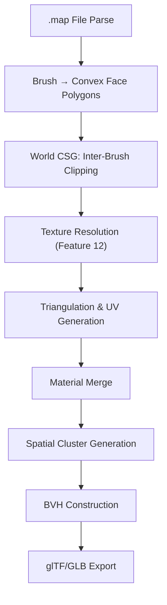

# Feature 12 — Texture Resolution & Material Generation

[← Back to main spec](../spec.md)

---

## Overview

Resolve texture metadata at compile time using a **`TextureProvider`** abstraction and use the results to generate **spec-compliant glTF materials**. Platform-specific implementations are provided for **Node.js** (filesystem) and **Browser** (native `Image` API). Resolved textures produce glTF materials with external texture references; unresolved textures produce a **magenta placeholder material** `[1, 0, 1, 1]`.

This feature replaces the manual `textureSizes: Map<string, [number, number]>` on `CompileOptions`. The `TextureProvider` is the sole source of texture dimensions and paths. The `defaultTextureSize` compile option remains as the fallback when a texture cannot be resolved.

**Input:** `ConvexPolygon[]` (from [Feature 3](03-world-csg.md)), optional `TextureProvider` (from `CompileOptions`)
**Output:** `TextureMap` — `Map<string, TextureInfo | null>` for every unique texture name in the polygon set

**Primary code files:** `src/pipeline/texture-resolution.ts`, `src/providers/node-texture-provider.ts`, `src/providers/browser-texture-provider.ts`

---

## Pipeline Placement

The texture resolution step runs **after** world CSG ([Feature 3](03-world-csg.md)) and **before** triangulation ([Feature 4](04-triangulation.md)). UV generation in Feature 4 needs the texture dimensions; resolution must happen before triangulation.



---

## Design Decisions

| Decision | Choice | Rationale |
|----------|--------|-----------|
| Strategy pattern | **Interface-based** (`TextureProvider`) | Single object with `resolve()` method; clean to pass, easy to extend. |
| `textureSizes` removal | **Removed from `CompileOptions`** | The `TextureProvider` is the sole source. `defaultTextureSize` remains as the fallback. |
| Pipeline placement | **New step between CSG and Triangulation** | UV generation needs the size map; resolution must happen before triangulation. |
| glTF texture reference | **External URI via `baseColorTexture`** | Spec-compliant; standard glTF viewers can load textures. Textures are not embedded in the GLB. |
| Unresolved texture handling | **Magenta placeholder** `[1, 0, 1, 1]` | Industry-standard missing-texture indicator; visually obvious in any viewer. Logged as a diagnostic warning. |
| Node.js image metadata | **`image-size` npm package** | Lightweight (~5 KB), reads only file headers, zero native dependencies. Uses `{ imageSize }` named import. |
| Browser image metadata | **Native `Image` API** | `new Image()` → `naturalWidth` / `naturalHeight`. Zero dependencies. |
| Diagnostics ownership | **Texture resolution step** | All "texture not found" warnings are emitted by `resolveTextures()`, not by triangulation. The `diagnostics` parameter was removed from `triangulate()`. |

---

## `TextureProvider` Interface

```typescript
interface TextureInfo {
    readonly relativePath: string;
    readonly size: [number, number];
}

interface TextureProvider {
    resolve(textureName: string): Promise<TextureInfo | null>;
}

type TextureMap = Map<string, TextureInfo | null>;
```

The interface is intentionally minimal — a single `resolve()` method combines location and metadata extraction. All three types (`TextureInfo`, `TextureProvider`, `TextureMap`) are defined in `src/types.ts` and re-exported from `src/compiler.ts`.

> **Implementation note — `exactOptionalPropertyTypes`:** The `textureProvider` and `textureBasePath` fields on `CompileOptions` must include an explicit `| undefined` suffix (e.g. `textureProvider?: TextureProvider | undefined`) to satisfy the `exactOptionalPropertyTypes` compiler flag.

---

## Texture Lookup Strategy

`.map` files specify only a bare texture name (e.g. `brick_wall`). The provider combines a **base path** with the texture name and a `.png` suffix:

```
<basePath>/<textureName>.png
```

* **Node.js:** `basePath` is a filesystem directory (absolute or relative to CWD).
* **Browser:** `basePath` is a URL prefix (absolute or relative to the page).

Only `.png` is attempted. Future extensions may add `.jpg`, `.tga`, or directory search.

### Caching

Each implementation caches resolved results for the duration of a single compilation. The cache maps `textureName → TextureInfo | null`. The same texture name may appear on hundreds of faces; re-reading for each is wasteful.

---

## Resolution Algorithm

```typescript
export async function resolveTextures(
    polygons: ConvexPolygon[],
    provider: TextureProvider | undefined,
    diagnostics: Diagnostics,
): Promise<TextureMap>
```

Behavior:

1. Collect unique texture names from the visible polygons.
2. Resolve them in parallel when a provider is available.
3. Populate a `TextureMap` with either `TextureInfo` or `null`.
4. Emit one diagnostic warning per unresolved texture.

The step is `async` because both platform providers involve I/O. Textures are resolved in parallel via `Promise.all`.

Implementation reference: [src/pipeline/texture-resolution.ts](../../src/pipeline/texture-resolution.ts).

---

## Platform Implementations

### Node.js — `NodeTextureProvider`

```typescript
export class NodeTextureProvider implements TextureProvider {
    constructor(basePath: string);
    resolve(textureName: string): Promise<TextureInfo | null>;
}
```

Behavior:

1. Build `<basePath>/<textureName>.png`.
2. Return cached results within the current compilation.
3. Read image dimensions with `image-size` when the file exists.
4. Return `null` for missing or unreadable files.

> **Implementation note — `image-size` import:** The `image-size` v2 package exports a named `imageSize` function (`import { imageSize } from 'image-size'`), not a default export. It accepts a `Buffer` or `Uint8Array`, not a file path string.

Implementation reference: [src/providers/node-texture-provider.ts](../../src/providers/node-texture-provider.ts).

**Dependency:** `image-size` is added to `dependencies` in `package.json`.

### Browser — `BrowserTextureProvider`

```typescript
export class BrowserTextureProvider implements TextureProvider {
    constructor(baseUrl: string);
    resolve(textureName: string): Promise<TextureInfo | null>;
}
```

**No dependencies.** Uses the browser-native `Image` element. Only `naturalWidth`/`naturalHeight` are read.

Implementation reference: [src/providers/browser-texture-provider.ts](../../src/providers/browser-texture-provider.ts).

---

## Build & Platform Compilation

| Concern | Approach |
|---------|----------|
| **Core library (`src/`)** | Platform-agnostic. `TextureProvider` interface has no platform-specific imports. |
| **Node.js provider** | `src/providers/node-texture-provider.ts`. Imports `node:fs`, `node:path`, `image-size`. |
| **Browser provider** | `src/providers/browser-texture-provider.ts`. Uses `Image` API. |
| **Package exports** | Sub-path exports: `map2gltf/node` and `map2gltf/browser`. |
| **Conditional usage** | Concrete implementations are imported explicitly by the consumer — no automatic platform detection. |

---

## Changes to `CompileOptions`

```typescript
interface CompileOptions {
    // ... existing fields ...
    readonly defaultTextureSize: number;            // retained — fallback for unresolved textures
    // REMOVED: textureSizes: Map<string, [number, number]>
    readonly textureProvider?: TextureProvider | undefined;  // NEW
    readonly textureBasePath?: string | undefined;           // NEW: asset-relative URI prefix used during export
}
```

* **`textureProvider`** is optional. When omitted, all textures fall back to `defaultTextureSize` and get placeholder materials (backward-compatible).
* **`textureBasePath`** is an asset-relative URI prefix applied during export. The CLI derives it from `--texture-path` and the final output location. Browser callers may provide it directly when they know where the exported asset will live relative to the texture files.

---

## Compiler Integration

The orchestrator (`src/compiler.ts`) wires the new step between CSG and triangulation:

1. Resolve textures after filtering visible polygons.
2. Pass the resulting `TextureMap` into triangulation for UV scale lookup.
3. Pass the same `TextureMap` and `textureBasePath` into binary export for material generation and external texture URI construction.

The `TextureProvider`, `TextureInfo`, and `TextureMap` types are re-exported from `compiler.ts` for library consumers.

Implementation reference: [src/compiler.ts](../../src/compiler.ts).

---

## File Structure

```
src/
├── types.ts                          # TextureProvider, TextureInfo, TextureMap added
├── providers/
│   ├── node-texture-provider.ts      # NodeTextureProvider
│   └── browser-texture-provider.ts   # BrowserTextureProvider
├── pipeline/
│   ├── texture-resolution.ts         # resolveTextures() step
│   └── ...
```

---

## Migration & Backward Compatibility

| Concern | Impact |
|---------|--------|
| **`textureSizes` removed from `CompileOptions`** | **Breaking.** Callers must switch to a `TextureProvider`. |
| **`compile()` without a provider** | Non-breaking. Behaves like before — `defaultTextureSize` used, placeholder materials emitted. |
| **`triangulate()` signature change** | Internal API — not part of the public surface. |
| **`exportGLB()` signature change** | Internal API — not part of the public surface. |
| **GLB output changes** | Materials now reference external textures through `images[].uri` when resolved. Textures are never embedded in `.glb` or `.gltf`. |

---

## Verification

### Unit Tests — Texture Resolution

1. **Resolved texture:** Mock a `TextureProvider` that returns `{ relativePath: 'brick.png', size: [128, 128] }`. Assert `resolveTextures()` returns the correct entry and no warnings are emitted.
2. **Unresolved texture:** Mock a provider that returns `null`. Assert the map entry is `null` and a diagnostic warning is emitted with step `'texture-resolution'`.
3. **No provider:** Call `resolveTextures()` with `undefined` provider. Assert all entries are `null` and warnings are emitted for each texture.
4. **Deduplication:** Call with 3 polygons all using the same texture. Assert the provider's `resolve()` is invoked only once.
5. **Parallel resolution:** Provide 10 unique texture names. Assert all are resolved in a single `Promise.all` batch.

### Unit Tests — Node Texture Provider

1. **File exists:** Place a test PNG in a fixtures directory. Assert `resolve()` returns correct dimensions.
2. **File missing:** Assert `resolve()` returns `null` for a nonexistent texture.
3. **Corrupt file:** Provide a file with invalid PNG data. Assert `resolve()` returns `null` (no throw).
4. **Caching:** Call `resolve()` twice for the same name. Assert the result is the same object reference (cached).

### Unit Tests — GLB Material Generation

1. **Resolved material:** Export with a resolved texture. Assert the output glTF JSON contains an `image` with the expected relative `uri`, a `texture` referencing it, and a material with `baseColorTexture`.
2. **Placeholder material:** Export with an unresolved texture. Assert the material has `baseColorFactor: [1, 0, 1, 1]` and no `baseColorTexture`.
3. **No textureMap:** Export with `textureMap` undefined. Assert materials use magenta placeholder.
4. **Texture deduplication:** Two materials referencing the same texture. Assert only one glTF image/texture entry.
5. **Mixed:** Export with both resolved and unresolved textures. Assert correct material types for each.

> **Implementation note — GLB texture inspection:** The exporter post-processes the GLB JSON chunk so that external textures appear as `images[].uri`. Tests should extract the raw JSON chunk from the GLB binary and inspect `images[].uri` rather than `images[].name`.

### Integration Tests

1. Run the full pipeline with `--texture-path` pointing to a directory containing matching PNGs. Assert the output GLB contains texture-referencing materials and relative `images[].uri` values.
2. Run without `--texture-path`. Assert all materials are magenta placeholders.
