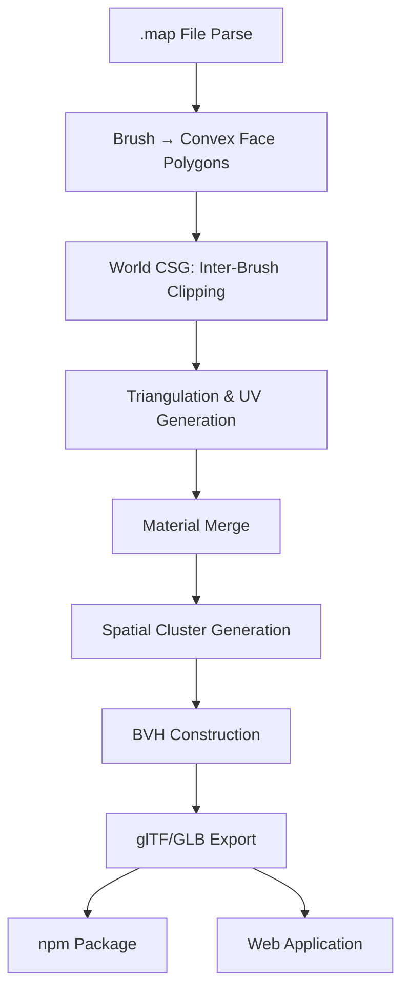
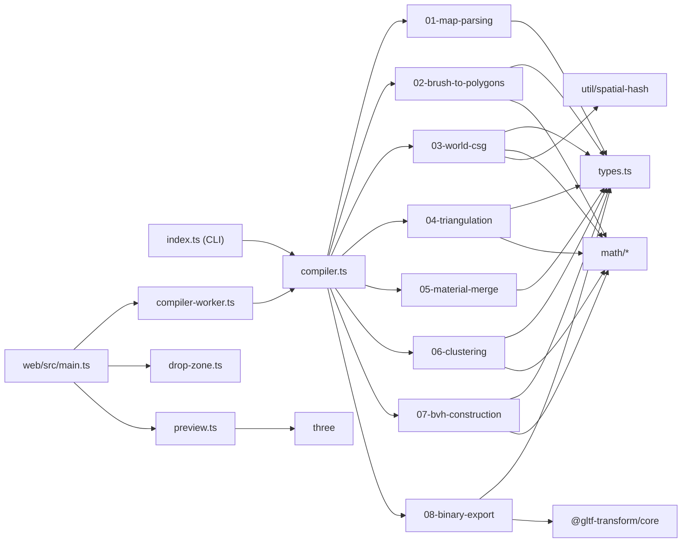
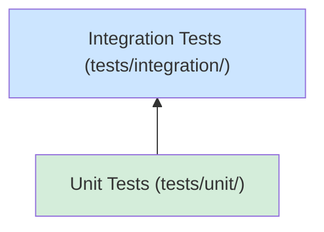

# Brush/CSG Map Compiler — Technical Specification

**Input:** Quake `.map` file (Standard format or Valve 220 format, as exported by TrenchBroom)
**Output:** Clustered static geometry + BVH in a `.glb` file (glTF 2.0 Binary)
**Implementation language:** TypeScript

**Output Artefacts:**

| Artefact | Description |
|----------|-------------|
| **npm package** (`map2gltf`) | Publishable library exposing the `compile()` API and CLI binary. Consumable from any Node.js or bundler-based project. See [Step 9](steps/09-npm-package.md). |
| **Web application** (`web/`) | Single-page app that accepts `.map` files via drag-and-drop or file picker, compiles them in-browser, and offers the resulting `.glb` for download / 3D preview. See [Step 10](steps/10-web-application.md). |

---

## Goals

* Fast CPU frustum culling via BVH over geometry clusters
* Low draw call count through material batching and cluster merging
* Standard glTF 2.0 output (inspectable in Blender, VS Code, three.js)
* Correct texture-mapped geometry derived from the Valve 220 texture axes (standard Quake format also supported with auto-derived axes)
* Reusable npm package consumable as both a library and a CLI tool
* Browser-based web application for interactive `.map` → `.glb` conversion

### Non-goals

* BSP tree construction
* Per-triangle rendering
* GPU-driven culling pipelines
* Lightmap generation (separate tooling, outside this specification)
* Runtime behavior (covered in a separate document)

---

## Compiler Pipeline



Steps 1–8 form the core compilation pipeline. Steps 9–10 define the distribution artefacts that wrap the pipeline for consumption as a library/CLI and as a browser application respectively. All compilation processing is offline; there are no real-time constraints on the compiler itself.

---

## Pipeline Steps

| Step | Document | Input | Output |
|------|----------|-------|--------|
| 1 | [Map Parsing](steps/01-map-parsing.md) | `.map` file (Standard or Valve 220 text) | `ParsedEntity[]` |
| 2 | [Brush → Polygons](steps/02-brush-to-polygons.md) | `ParsedBrush` | `ConvexPolygon[]` per brush |
| 3 | [World CSG](steps/03-world-csg.md) | All `ConvexPolygon[]` | Clipped `ConvexPolygon[]` (no hidden faces) |
| 4 | [Triangulation & UVs](steps/04-triangulation.md) | `ConvexPolygon[]`, `textureSizes` | `TriangulatedMesh` (vertices, indices, per-triangle material) |
| 5 | [Material Merge](steps/05-material-merge.md) | `TriangulatedMesh` | `MaterialBatch[]` |
| 6 | [Clustering](steps/06-clustering.md) | `MaterialBatch[]` | `Cluster[]` |
| 7 | [BVH Construction](steps/07-bvh-construction.md) | `Cluster[]` | `BVHNode[]` |
| 8 | [glTF/GLB Export](steps/08-binary-export.md) | All compiled data | `.glb` file (glTF 2.0 Binary) |
| 9 | [npm Package](steps/09-npm-package.md) | Compiled source | Publishable npm package (library + CLI) |
| 10 | [Web Application](steps/10-web-application.md) | npm package (library) | Single-page web app for in-browser conversion, BVH tree viewer, cluster highlighting, metadata panel |

---

## Shared Types

These interfaces are used across multiple pipeline steps.

```typescript
interface Vec2 {
    x: number;
    y: number;
}

interface Vec3 {
    x: number;
    y: number;
    z: number;
}

interface AABB {
    min: Vec3;
    max: Vec3;
}
```

---

## Compile-Time Parameters

| Parameter              | Value              |
|------------------------|--------------------|
| Plane classification ε | 1e-5               |
| Seed polygon extent    | 65536 units        |
| Vertex dedup tolerance | 1e-4 per component |
| Default texture size   | 64×64              |
| Grid cell size         | 16 world units     |
| Max cluster size       | 512 triangles      |
| Min cluster size       | 8 triangles        |
| BVH leaf threshold     | 4 clusters         |
| SAH split candidates   | 12 per axis        |

---

## Project Structure

```
[project root]
├── src/
│   ├── index.ts                  # CLI entry point
│   ├── compiler.ts               # Top-level pipeline orchestrator
│   ├── types.ts                  # Shared interfaces (Vec2, Vec3, AABB, etc.)
│   ├── math/
│   │   ├── vec3.ts               # Vec3 operations (add, sub, dot, cross, normalize, …)
│   │   ├── plane.ts              # Plane construction, classification, intersection
│   │   └── aabb.ts               # AABB construction, merge, surface area
│   ├── pipeline/
│   │   ├── 01-map-parsing.ts
│   │   ├── 02-brush-to-polygons.ts
│   │   ├── 03-world-csg.ts
│   │   ├── 04-triangulation.ts
│   │   ├── 05-material-merge.ts
│   │   ├── 06-clustering.ts
│   │   ├── 07-bvh-construction.ts
│   │   └── 08-binary-export.ts
│   └── util/
│       ├── diagnostics.ts        # Warning/error accumulator
│       └── spatial-hash.ts       # Uniform grid for CSG acceleration
├── web/
│   ├── index.html                # Single-page application shell
│   ├── src/
│   │   ├── main.ts               # App entry point (event wiring, init)
│   │   ├── drop-zone.ts          # Drag-and-drop + file input handler
│   │   ├── compiler-worker.ts    # Web Worker wrapper for compile()
│   │   ├── preview.ts            # three.js GLB preview renderer
│   │   └── ui.ts                 # Progress bar, error display, download trigger
│   ├── public/
│   │   └── favicon.svg
│   ├── tsconfig.json             # Extends root tsconfig with DOM lib
│   └── vite.config.ts            # Vite build configuration
├── tests/
│   ├── fixtures/                 # .map files, expected outputs, golden GLBs
│   │   ├── box.map
│   │   ├── two-boxes.map
│   │   ├── wedge.map
│   │   ├── hollow-room.map
│   │   ├── two-rooms.map
│   │   ├── textured-room.map
│   │   ├── room-with-pillar.map
│   │   └── large-map.map
│   ├── unit/
│   │   ├── math/
│   │   │   ├── vec3.test.ts
│   │   │   ├── plane.test.ts
│   │   │   └── aabb.test.ts
│   │   ├── 01-map-parsing.test.ts
│   │   ├── 02-brush-to-polygons.test.ts
│   │   ├── 03-world-csg.test.ts
│   │   ├── 04-triangulation.test.ts
│   │   ├── 05-material-merge.test.ts
│   │   ├── 06-clustering.test.ts
│   │   ├── 07-bvh-construction.test.ts
│   │   └── 08-binary-export.test.ts
│   ├── integration/
│   │   ├── pipeline.test.ts      # End-to-end .map → .glb tests
│   │   └── glb-validation.test.ts# Structural validation of output GLBs
│   └── web/
│       └── drop-zone.test.ts     # File input & drag-and-drop unit tests
├── spec/
│   ├── spec.md                   # This specification document
│   └── steps/
│       ├── 01-map-parsing.md
│       ├── 02-brush-to-polygons.md
│       ├── 03-world-csg.md
│       ├── 04-triangulation.md
│       ├── 05-material-merge.md
│       ├── 06-clustering.md
│       ├── 07-bvh-construction.md
│       ├── 08-binary-export.md
│       ├── 09-npm-package.md
│       └── 10-web-application.md
├── tsconfig.json
├── package.json
└── README.md
```

### TypeScript Configuration

Target **ES2022** with **Node 18+** module resolution. Strict mode is enabled in full.

```jsonc
// tsconfig.json
{
    "compilerOptions": {
        "target": "ES2022",
        "module": "Node16",
        "moduleResolution": "Node16",
        "outDir": "dist",
        "rootDir": "src",
        "strict": true,
        "noUncheckedIndexedAccess": true,
        "exactOptionalPropertyTypes": true,
        "declaration": true,
        "declarationMap": true,
        "sourceMap": true,
        "esModuleInterop": true,
        "forceConsistentCasingInFileNames": true,
        "skipLibCheck": true,
        "types": ["node"]
    },
    "include": ["src"],
    "exclude": ["node_modules", "dist", "tests"]
}
```

Key choices:

| Setting | Rationale |
|---------|-----------|
| `strict: true` | Catches null/undefined bugs in math-heavy code |
| `noUncheckedIndexedAccess` | Prevents silent `undefined` when indexing vertex/index arrays |
| `module: "Node16"` | Native ESM with `.ts` extension imports; matches Node 18+ |
| `target: "ES2022"` | `Array.at()`, `structuredClone`, top-level await available |
| `types: ["node"]` | Explicitly includes Node.js type definitions for CLI entry point |

### Build & Run

The project uses **tsx** for development (zero-config TypeScript execution) and **tsc** for production builds. The web application uses **Vite** for development and bundling.

```jsonc
// package.json (relevant fields)
{
    "name": "map2gltf",
    "type": "module",
    "main": "dist/compiler.js",
    "types": "dist/compiler.d.ts",
    "exports": {
        ".": {
            "import": "./dist/compiler.js",
            "types": "./dist/compiler.d.ts"
        }
    },
    "bin": { "map2gltf": "dist/index.js" },
    "files": ["dist", "README.md", "LICENSE"],
    "scripts": {
        "build": "tsc",
        "build:web": "vite build web",
        "dev": "tsx src/index.ts",
        "dev:web": "vite dev web",
        "preview:web": "vite preview web",
        "test": "vitest run",
        "test:watch": "vitest",
        "test:coverage": "vitest run --coverage",
        "lint": "eslint src tests web",
        "typecheck": "tsc --noEmit",
        "prepublishOnly": "npm run build"
    },
    "engines": { "node": ">=18.0.0" }
}
```

### Dependencies

| Package | Purpose | Type |
|---------|---------|------|
| `@gltf-transform/core` | GLB/glTF construction in Step 8 | runtime |
| `tsx` | TypeScript execution during development | dev |
| `vitest` | Test runner | dev |
| `eslint` | Linting | dev |
| `typescript` | Compiler & type checker | dev |
| `@vitest/coverage-v8` | Code coverage via V8 | dev |
| `@types/node` | Node.js type definitions | dev |
| `vite` | Web application dev server & bundler | dev |
| `three` | 3D preview renderer in the web application | dev (web) |
| `@types/three` | TypeScript types for three.js | dev (web) |

No other runtime dependencies for the core library. All math utilities (`vec3`, `plane`, `aabb`) and pipeline steps are implemented from scratch — no external geometry or CSG libraries. The web application adds `three` (loaded client-side only) and `vite` as a build tool.

---

## Architecture

### Pipeline Orchestrator

The compiler is structured as a linear pipeline of pure transformation functions. Each step is a single exported function with an explicit input → output signature and no shared mutable state.

```typescript
// compiler.ts — top-level orchestration
import { parseMap } from './pipeline/01-map-parsing.js';
import { brushToPolygons } from './pipeline/02-brush-to-polygons.js';
import { worldCSG } from './pipeline/03-world-csg.js';
import { triangulate } from './pipeline/04-triangulation.js';
import { mergeMaterials } from './pipeline/05-material-merge.js';
import { clusterGeometry } from './pipeline/06-clustering.js';
import { buildBVH } from './pipeline/07-bvh-construction.js';
import { exportGLB } from './pipeline/08-binary-export.js';

export async function compile(mapSource: string, options: CompileOptions): Promise<Uint8Array> {
    const entities    = parseMap(mapSource);

    // World geometry (entity 0 / worldspawn): all brushes merged for CSG
    const worldEntity = entities[0];
    let brushIdx = 0;
    const worldPolys  = worldEntity
        ? worldEntity.brushes.flatMap(b => brushToPolygons(b, brushIdx++, 0))
        : [];
    const clipped     = worldCSG(worldPolys);

    // Non-world entities (func_wall, func_door, …): compiled per-entity, no inter-entity CSG
    let entityIdx = 1;
    const entityPolys = entities.slice(1).flatMap(e => {
        const polys = e.brushes.flatMap(b => brushToPolygons(b, brushIdx++, entityIdx));
        entityIdx++;
        return polys;
    });

    const allPolygons = [...clipped, ...entityPolys];

    // Handle empty map: produce a minimal valid GLB
    if (allPolygons.length === 0) {
        return exportGLB([], [], [{ bounds: { min: {x:0,y:0,z:0}, max: {x:0,y:0,z:0} }, left: -1, right: -1, firstCluster: 0, clusterCount: 0 }]);
    }

    const mesh        = triangulate(allPolygons, options.textureSizes);
    const batches     = mergeMaterials(mesh);
    const clusters    = clusterGeometry(batches);
    const bvh         = buildBVH(clusters);
    const glb         = await exportGLB(batches, clusters, bvh);
    return glb;
}
```

> **Implementation note — async API:** The `compile()` and `compileWithDiagnostics()` functions are `async` and return `Promise<Uint8Array>` / `Promise<{glb, diagnostics}>` respectively. This is because `exportGLB()` uses `@gltf-transform/core`'s `NodeIO.writeBinary()` which is async. Callers must `await` the result.
>
> **Implementation note — empty maps:** If the parsed map produces zero polygons (empty or entity-only file), the compiler returns a minimal valid GLB containing an empty root node rather than throwing.
>
> **Implementation note — multi-entity handling:** Only entity 0 (worldspawn) brushes participate in CSG. Other entities (func_wall, func_door, etc.) are passed through to triangulation without CSG, preserving their full geometry.

### Design Principles

1. **Pure functions.** Each pipeline step is a pure function: it takes immutable input and returns new output. No step mutates its input data. This makes every step independently testable and composable.

2. **Explicit data flow.** Data is passed via function arguments and return values — never through module-level singletons, global state, or event buses. The orchestrator is the single place where the full data flow is visible.

3. **Diagnostics accumulator.** Warnings and non-fatal errors (e.g. degenerate brushes, missing textures) are collected in a `Diagnostics` object threaded through the pipeline, not thrown as exceptions. Only unrecoverable errors (malformed `.map` file, I/O failure) throw. A `createDiagnostics()` factory function provides a convenience constructor.

    ```typescript
    interface Diagnostics {
        warnings: DiagnosticMessage[];
        errors: DiagnosticMessage[];
    }

    interface DiagnosticMessage {
        step: string;       // e.g. "01-map-parsing"
        message: string;
        location?: string;  // e.g. "entity 3, brush 7, face 2"
    }

    function createDiagnostics(): Diagnostics {
        return { warnings: [], errors: [] };
    }
    ```

4. **Configuration via `CompileOptions`.** All compile-time parameters from the table above are bundled into a single options object with sensible defaults, overridable from the CLI. A `DEFAULT_OPTIONS` constant is exported for reference.

    ```typescript
    interface CompileOptions {
        epsilon: number;             // default: 1e-5
        seedExtent: number;          // default: 65536
        vertexDedup: number;         // default: 1e-4
        defaultTextureSize: number;  // default: 64
        gridCellSize: number;        // default: 16
        maxClusterSize: number;      // default: 512
        minClusterSize: number;      // default: 8
        bvhLeafThreshold: number;    // default: 4
        sahCandidates: number;       // default: 12
        textureSizes: Map<string, [number, number]>; // texture name → [w, h]
    }

    const DEFAULT_OPTIONS: CompileOptions = { /* all defaults as listed above */ };
    ```

    > **Implementation note — hardcoded parameters:** In the current implementation, pipeline steps (02 through 07) use hardcoded constants for epsilon, seed extent, grid cell size, cluster limits, BVH thresholds, and SAH candidates rather than reading from `CompileOptions`. The `CompileOptions` interface is defined and accepted by `compile()`, but only `textureSizes` is actively threaded through to the pipeline. The remaining parameters serve as documentation of the chosen values and as API surface for future configurability.

5. **No class hierarchies.** The codebase uses plain interfaces and functions. Geometry types (`Vec3`, `ConvexPolygon`, `Vertex`, etc.) are plain objects — no classes with methods, no inheritance. Utility operations are standalone functions in the `math/` module.

### Module Dependency Graph



Dependencies flow strictly downward: pipeline steps depend on `types` and `math`, never on each other. The only external runtime dependency for the core library is `@gltf-transform/core` used exclusively by Step 8. The web application adds `three` for the 3D preview and consumes the core `compile()` function via a Web Worker.

---

## Test Strategy

### Framework

All tests use **Vitest** — chosen for native ESM + TypeScript support, fast execution, and built-in coverage via `@vitest/coverage-v8`.

```typescript
// vitest.config.ts
import { defineConfig } from 'vitest/config';

export default defineConfig({
    test: {
        include: ['tests/**/*.test.ts'],
        coverage: {
            provider: 'v8',
            include: ['src/**'],
            exclude: ['src/index.ts'],   // CLI entry point tested via integration
            thresholds: {
                statements: 90,
                branches: 85,
                functions: 90,
                lines: 90,
            },
        },
    },
});
```

### Test Layers



#### 1. Unit Tests — `tests/unit/`

One test file per pipeline step and per math module. Each step's tests are specified in its own step document (see [Step 1](steps/01-map-parsing.md) through [Step 10](steps/10-web-application.md)).

**Scope:** Single function, single step. All inputs are constructed in-memory — no file I/O. Dependencies on prior steps are satisfied by hand-crafted fixture data, not by running the actual pipeline.

**Naming convention:** `describe('stepName')` → `it('should …')`. Test names describe the invariant being checked, not the implementation detail.

**Math module tests** (`tests/unit/math/`) cover foundational operations that every step relies on:

| Module | Key tests |
|--------|-----------|
| `vec3` | `dot`, `cross`, `normalize`, `length`, `sub`, `add`, `scale`, edge cases (zero vector, near-parallel) |
| `plane` | Plane from 3 points, vertex classification (front/back/on), line-plane intersection |
| `aabb` | Construction from point set, merge two AABBs, surface area, containment check |

#### 2. Integration Tests — `tests/integration/`

End-to-end tests that run the full pipeline from `.map` source string to `.glb` byte array.

| Test | Input | Assertions |
|------|-------|------------|
| **Box room** | `hollow-room.map` (6 brushes) | GLB passes `gltf-validator`, correct material count, correct node hierarchy depth |
| **Two touching boxes** | `two-boxes.map` | CSG removes shared face, total triangle count < unclamped count |
| **Multi-material** | `textured-room.map` (3+ textures) | 3 glTF materials, each with correct `name` |
| **Large map** | `large-map.map` (50+ brushes) | Compiles without error, BVH depth is reasonable (< 20), all clusters in [minSize, maxSize] |
| **Round-trip BVH** | Any map | Rebuild flat BVH from glTF node tree, assert identical to pre-export BVH |
| **npm package import** | Any map | Import `compile` from package entry point, compile map, assert valid GLB output |

Integration tests load `.map` fixtures from `tests/fixtures/`.

### Test Fixtures

Test fixtures are committed `.map` files stored in `tests/fixtures/`. They are the single source of truth for integration tests.

> **Implementation note:** Test fixtures use the **Standard Quake format** (not Valve 220) for simplicity. The parser supports both formats; Standard format fixtures exercise the auto-derived texture axis fallback path.

| Fixture | Description | Primary use |
|---------|-------------|-------------|
| `box.map` | Single axis-aligned box brush | Step 1–2 unit tests, minimal pipeline smoke test |
| `two-boxes.map` | Two touching boxes sharing a face | Step 3 CSG verification |
| `wedge.map` | Triangular prism brush | Step 2 non-quad polygon test |
| `hollow-room.map` | Hollow box room (6 brushes: floor, ceiling, 4 walls) | Integration: Box room test, Step 5 smoke test (2 textures: floor + walls) |
| `two-rooms.map` | Two rooms connected by a doorway | Integration: multi-brush CSG + clustering |
| `textured-room.map` | Room with 3+ distinct textures | Step 4–5 UV + material merge verification, Integration: Multi-material |
| `room-with-pillar.map` | Room (6 brushes) with a pillar brush in the center | Step 3 CSG smoke test |
| `large-map.map` | Complex map with 50+ brushes (multi-room, corridors, pillars) | Integration: Large map test, Step 6–7 smoke tests |

### Running Tests

```bash
# Run all tests once
npm test

# Watch mode during development
npm run test:watch

# Coverage report
npm run test:coverage

# Run a single step's tests
npx vitest run tests/unit/04-triangulation.test.ts
```

### CI Integration

Tests are expected to run in CI on every push. The recommended pipeline:

1. `npm ci` — install locked dependencies
2. `npm run typecheck` — verify types without emitting
3. `npm run lint` — static analysis
4. `npm test` — unit + integration tests with coverage
5. `npm run build:web` — build the web application
6. Fail the build if coverage drops below thresholds
